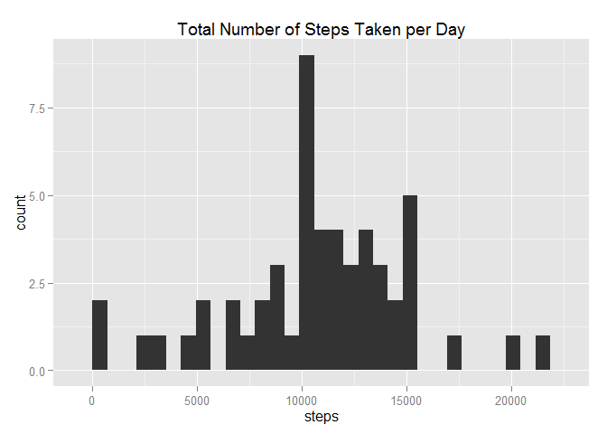
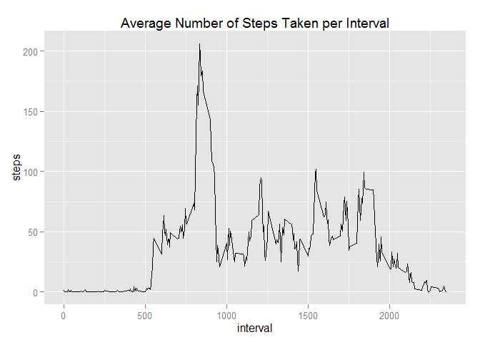
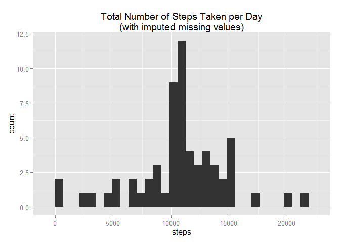
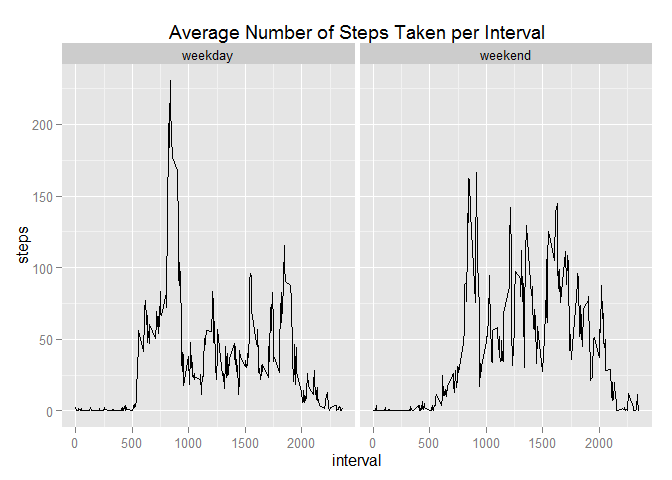

# Reproducible Research: Peer Assessment 1
Christopher A. Mejia  

Synopsis
========

This report analyzes data from an anonymous individual collected during the months of October and November, 2012, consisting of the number of steps taken in 5-minute intervals each day.  The analysis calculates the mean number of steps taken per day, and the average daily activity pattern.  The report calculates the mean number of steps taken per day both before and after imputing missing values.  Finally, the average daily activity pattern is plotted separately for weekdays and weekends.

Loading and Preprocessing the Data
==================================


```r
download.file("https://d396qusza40orc.cloudfront.net/repdata%2Fdata%2Factivity.zip",
              "repdata-data-activity.zip", method = "curl")
dateDownloaded <- date()

unzip("repdata-data-activity.zip")
activity <- read.csv("activity.csv", header = TRUE,
                     colClasses = c(NA, "Date", NA))
```

The data for this study was downloaded from this link: [Activity monitoring data](https://d396qusza40orc.cloudfront.net/repdata%2Fdata%2Factivity.zip) on Sun Apr 12 18:50:39 2015.  Note that the date column was converted to Date type as part of the read.csv command.

Analyses
========

Mean Total Number of Steps Taken per Day
----------------------------------------

First, we calculate the total number of steps taken per day.


```r
totalStepsByDate <- aggregate(steps ~ date, data = activity, FUN = sum)
library(ggplot2)
qplot(steps, data = totalStepsByDate, geom = "histogram",
      main = "Total Number of Steps Taken per Day") 
```

 

```r
meanTotalStepsByDate <- as.character(mean(totalStepsByDate$steps))
medianTotalStepsByDate <- median(totalStepsByDate$steps)
```

The mean of the total number of steps taken per day is 10766.1886792453, and the median of the total number of steps taken per day is 10765.

Average Daily Activity Pattern
------------------------------

Next, we calculate the number of steps taken in each 5-minute interval, averaged across all days.


```r
meanStepsByInterval <- aggregate(steps ~ interval, data = activity, FUN = mean)
qplot(interval, steps, data = meanStepsByInterval, geom = "line",
      main = "Average Number of Steps Taken per Interval")
```

 

```r
maxInterval <- meanStepsByInterval$interval[which.max(meanStepsByInterval$steps)]
```

The interval numbered 835, when averaged across all days in the dataset, contains the maximum number of steps.

Imputing Missing Values
-----------------------

Analyses up to this point have ignored missing values in the dataset.


```r
ok <- complete.cases(activity)
incompleteCases <- sum(!ok)
```

The total number of missing values (i.e. the total number of rows with NA's) is 2304.  Since we have already calculated a data frame containing the mean number of steps for each 5-minute interval, we will use this data frame along with R's merge command to fill in the missing values.  The merged data set will include a column for the mean number of steps for the corresponding 5-minute interval; if the actual data for that 5-minute interval for a particular day is missing, it is filled in with the mean value.


```r
imputed <- merge(activity, meanStepsByInterval, by = "interval")
imputed$steps.x[is.na(imputed$steps.x)] <- imputed$steps.y[is.na(imputed$steps.x)]
names(imputed)[names(imputed) == "steps.x"] <- "steps"
imputed <- subset(imputed, select = -steps.y)
```

Note that although the order of the rows and columns of this new imputed data frame are different from the order in the original activity data frame, they are essentially equal except that the missing data has been filled in.  Let's recreate the histogram and calculate the mean and median again, using the imputed data set:


```r
impTotalStepsByDate <- aggregate(steps ~ date, data = imputed, FUN = sum)
qplot(steps, data = impTotalStepsByDate, geom = "histogram",
      main = "Total Number of Steps Taken per Day\n(with imputed missing values)") 
```

 

```r
meanImp <- as.character(mean(impTotalStepsByDate$steps))
medianImp <- median(impTotalStepsByDate$steps)
```

Now, with the imputed missing data, the mean of the total number of steps taken per day is 10766.1886792453, and the median of the total number of steps taken per day is 1.0766189\times 10^{4}.  The mean is the same as our previous answer, however the median is not; in fact the median is now equal to the mean.

Differences in Activity Patterns between Weekdays and Weekends
--------------------------------------------------------------

Finally, we create a new factor variable to distinguish weekdays from weekend days.


```r
imputed$daytype <- factor(weekdays(imputed$date) %in% c("Saturday", "Sunday"),
                            labels = c("weekday", "weekend"))
```

Plot the activity patterns separately for both.


```r
impMeanStepsByInterval <- aggregate(steps ~ interval + daytype, data = imputed, FUN = mean)
p <- qplot(interval, steps, data = impMeanStepsByInterval, geom = "line",
      main = "Average Number of Steps Taken per Interval") 
p + facet_wrap(~ daytype)
```

 

Note that the weekday activity level peaks in the morning, whereas the weekend activity level is more constant throughout the day.
